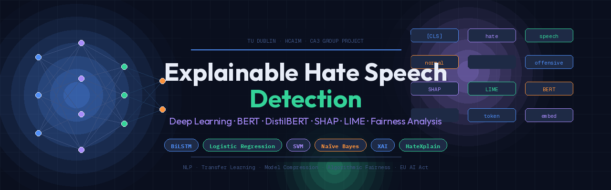

# 🛡️ Explainable Hate Speech Detection Using Deep Learning



> A multi-class NLP pipeline for detecting hate speech on social media,
> with explainability and demographic bias analysis at its core.

---

## 📌 Overview

This project was developed as part of **Combined Project 2 (CA3)** for the
[Human-Centred AI Masters (HCAIM)](https://www.tudublin.ie/) programme at **TU Dublin**.

It spans three modules:
- **HCDL** — HC Deep Learning
- **ETech** — Emerging Technologies in AI
- **SAI** — Society and AI

The system classifies social media posts into three categories:
`Normal` · `Offensive` · `Hate Speech`

---

## 🎯 Research Questions

| # | Module | Question |
|---|--------|----------|
| RQ1 | HCDL | How does BiLSTM compare to Logistic Regression and traditional ML baselines? |
| RQ2 | ETech | Can BERT + DistilBERT improve performance, and what do SHAP/LIME reveal? |
| RQ3 | SAI | Does the model exhibit bias across demographic groups, and what are the ethical implications? |

---

## 📦 Dataset

**HateXplain** — ~20,000 annotated social media posts  
Source: [HateXplain GitHub](https://github.com/hate-alert/HateXplain)

Features include five demographic target columns:
`Race` · `Religion` · `Gender` · `Sexual Orientation` · `Miscellaneous`

> ⚠️ The raw dataset is not included in this repo. Download it from the link above
> and place it in the `data/` folder.

---

## 🧠 Models

| Model | Type | Purpose |
|-------|------|---------|
| Logistic Regression | Glass-box | Interpretable baseline |
| BiLSTM | Black-box | Deep learning classifier |
| SVM | Traditional ML | Comparison baseline |
| Naïve Bayes | Traditional ML | Comparison baseline |
| BERT | Emerging (Transfer Learning) | Fine-tuned transformer |
| DistilBERT | Emerging (Model Compression) | Efficient BERT variant |

---

## 🔍 Explainability (XAI)

- **SHAP** — Feature importance across all models
- **LIME** — Local explanations for individual predictions
- Applied to both correct and incorrect predictions across all three classes

---

## ⚖️ Ethics & Fairness

Demographic bias analysis investigates whether the model performs
differently across protected groups. The ethical discussion covers:
- Algorithmic bias and fairness
- Privacy in automated content monitoring
- Free speech vs. platform safety
- EU AI Act implications

---

## 🚀 Getting Started

```bash
# Clone the repo
git clone https://github.com/YOUR_USERNAME/hate-speech-detection.git
cd hate-speech-detection

# Install dependencies
pip install -r requirements.txt

# Run notebooks in order
jupyter notebook notebooks/
```

---

## 👥 Team

| Name | Student ID |
|------|-----------|
| Raghav [Last Name] | [ID] |
| [Teammate 2] | [ID] |
| [Teammate 3] | [ID] |
| [Teammate 4] | [ID] |

**Programme:** MSc Human-Centred AI — TU Dublin, Tallaght Campus  
**Academic Year:** 2025–2026

---

## 📄 License

This project is for academic purposes. Dataset usage follows the
[HateXplain licence terms](https://github.com/hate-alert/HateXplain).
